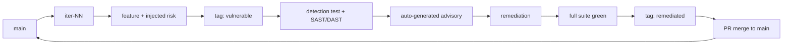

Document Name: Iteration Playbook
Covered Elements: Per-iteration red-to-green lifecycle, branching and tagging conventions, A10->A01 feature/risk mapping
Creation Date: 26/07/2026-13:40:00.000

# Iteration Playbook

Every OWASP iteration follows the same lifecycle. This is the operational
counterpart to [`architecture/overview.md`](architecture/overview.md).

## Branch and tag conventions

- Branch: `iter-<NN>-owasp-<risk>-<slug>` (e.g. `iter-01-owasp-a10-exceptional-conditions`).
- Two tags per iteration:
  - `iter-<NN>-<risk>-vulnerable` — the deliberately vulnerable state.
  - `iter-<NN>-<risk>-remediated` — the fixed state.

A reviewer can check out the `*-vulnerable` tag and watch the pipeline fail on
demand; both runs are archived permanently on the `reports` branch.

## Lifecycle (Red → Red → Green → validate → tag → merge)

1. **Branch** from `main`.
2. **Red (feature + risk):** ship a genuine feature that carries the risk by
   design. Commit; push.
3. **Red (detection):** add the detection test(s) under `tests/` and let SAST or
   DAST catch the flaw. `ci-advisory.yml` generates the advisory from the failing
   detection run plus scanner evidence. Tag `*-vulnerable`.
4. **Green (remediate):** fix the flaw. The detection test now passes; scans go
   clean.
5. **Validate:** `run_all_tests.sh` (or the full CI) is green. Tag `*-remediated`.
6. **Merge:** open a PR into `main`; the quality gate must be green to merge.

## The countdown (A10 → A01)

| # | Risk (OWASP Top 10:2025 Web) | Feature vehicle | Injected flaw → fix |
| --- | --- | --- | --- |
| iter-01 | A10 Mishandling of Exceptional Conditions | CSV bulk import + order-status state machine | stack-trace leaks, fail-open transitions → global handler, RFC 9457, fail-closed |
| iter-02 | A09 Security Logging & Alerting Failures | admin audit trail | authz failures unlogged, PII in logs → structured JSON logging + redaction, audit events, threshold alerts |
| iter-03 | A08 Software or Data Integrity Failures | store theme upload + receipts | unsigned artifacts, `pickle` deser → HMAC verify, JSON-only, checksum manifest |
| iter-04 | A07 Authentication Failures | password reset + sessions | no rate limit, predictable token, non-expiring JWT → short-lived rotating tokens, lockout, revocation |
| iter-05 | A06 Insecure Design | mock credits + coupons | reusable coupons, negative qty, stock race → threat model, invariants, idempotency keys, DB constraints |
| iter-06 | A05 Injection | product search + order notes | raw SQL concat, Jinja2 `\| safe` bypass → parameterized queries, Pydantic validation, output encoding, CSP |
| iter-07 | A04 Cryptographic Failures | PII storage + anonymized delivery view | MD5 hashing, plaintext PII, no `Secure` → Argon2, encryption at rest, secret mgmt, HSTS |
| iter-08 | A03 Software Supply Chain Failures | mock shipping-rate integration | unpinned deps, blind upstream trust → hash-pinned lock, SBOM, upstream schema validation |
| iter-09 | A02 Security Misconfiguration | deployment hardening | `DEBUG=true`, wildcard CORS, root container, `/docs` in prod → env-driven config, allowlist, headers middleware, non-root, per-env Swagger policy |
| iter-10 | A01 Broken Access Control | cross-store revenue analytics | BOLA/IDOR on sequential ids, mass assignment of `role` → central policy service, object-level checks, UUIDv4, explicit DTOs |

Each advisory cross-references the corresponding **OWASP API Security Top 10**
risk (see [`decisions/0004-owasp-2025-web-list.md`](decisions/0004-owasp-2025-web-list.md)).

## Phase 1 baseline honesty

Phase 1 deliberately ships an un-hardened baseline (`DEBUG=true`, wildcard CORS,
exposed `/docs`) so iter-09 has something real to fix. Do not "pre-harden" these
in Phase 1 — the honest baseline is the point.
